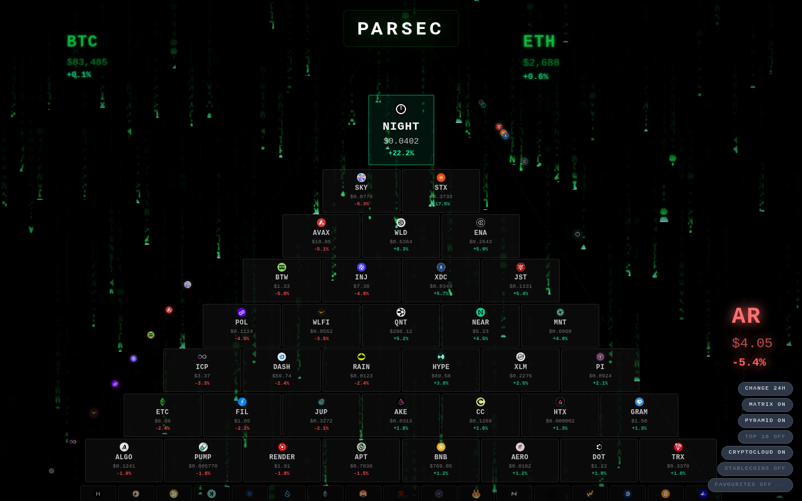
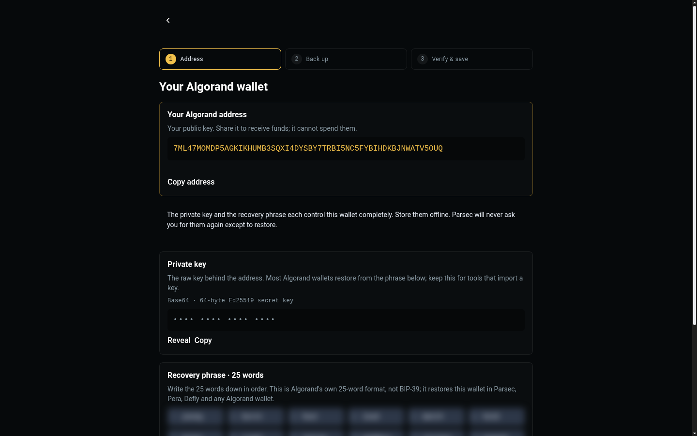

<p align="center">
  
</p>

<h1 align="center">PARSEC</h1>

<p align="center">
  <b>Sovereign multi-chain wallet — Algorand first; Solana, Arweave, EVM / Base and Bitcoin beside it.</b><br>
  Your keys. Your coins. No compromises.
</p>

<p align="center">
  
  
  
  
  
  
  
</p>

<p align="center">
  
</p>

PARSEC is a desktop wallet that keeps the part able to spend your money small and inspectable:
**Rust signs and validates; the TypeScript interface only asks**. It is Algorand first, because
Algorand's accounts can move to Falcon-1024 keys while keeping their address
([QUANTUM.md](QUANTUM.md)). It runs as a Tauri 2 desktop app, and the same frontend build ships to
the permaweb. Status: **alpha** — see [Where it stands](#where-it-stands).

Public home: **[github.com/parsec-wallet/PARSEC](https://github.com/parsec-wallet/PARSEC)** ·
for agents: [llms.txt](https://github.com/parsec-wallet/.github/blob/main/llms.txt)

## What it does

**Wallets and chains**

- **Create a wallet in three plain steps** — your address first; then the private key and the
  recovery phrase, each hidden until revealed and each copyable; then verify and save into the vault.
  Algorand uses its own 25-word phrase; Solana and Arweave use 24-word BIP-39 (the Arweave key also
  downloads as its JWK).
- **Choose your chains** — Algorand (required, first), Bitcoin (desktop, native SegWit), Solana
  (SLIP-0010, Phantom-compatible), Arweave (RSA-4096, generated in a Web Worker), EVM / Base
  (EIP-55). Also Algorand HD (ARC-52) and EVM → Algorand xChain accounts.
- **Import** an Algorand mnemonic, a base64 private key, or a watch-only address; many accounts,
  switched from the header.
- **Send and receive** ALGO, any Algorand Standard Asset, SOL and AR; ASA opt-in with a registry of
  known assets (USDC, USDt) and a freeze/clawback warning before opt-in.
- **SpinTrade** — in-wallet swaps, aggregated across Tinyman (on-chain and API) and Pact.

**Payments and names**

- **x402** — pay any `402 Payment Required` resource from the x402 desk: probe it, see the price per
  network, pick the rail explicitly, approve; the receipt keeps the settled transaction id. Rails for
  Algorand (USDC, facilitator-sponsored, no ALGO needed for fees), EVM (EIP-3009) and Solana. Browse
  sellers in the Bazaar. Standalone module: [parsec-wallet/x402](https://github.com/parsec-wallet/x402).
- **.algo Names** — search, register and manage `.algo` names (NFD). The review screen separates
  what registration requires — the NFD registry price and network fee, in ALGO — from the **BANKON
  fee**, in USDC over x402. Two currencies, two parties, never added together.
- **Names and markets** — ArNS, BANKON Names and Solana-ArNS through one name hub; Marketspace
  listings and auctions as an AO process.

**The rest of the wallet**

- **The landing** — a live market view: a pyramid of the top coins ranked by the period you choose
  (1h, 4h, 24h, 7d, 30d), price glyphs that float or sink, stablecoin pegs and supply flow, top 10 and
  favourites. Red Pill to open the wallet; Blue Pill for view-only diagnostics that can never sign.
- **Permaweb** — upload to Arweave through Turbo, manage ArNS, bridge ARIO, join ar.io as a gateway.
- **PARSEC Connect** — a local dApp bridge on `ws://127.0.0.1:9876`; every signature is approved on
  screen.
- **Desktop shell** — PARSEC's own title bar and icon, a tray (Show, Lock wallet, Quit),
  close-to-tray and start at login (both in Settings → Window).
- **Also** — Identity, the Mausoleum (cold storage), a Key Ceremony for air-gapped keys,
  Diagnostics, the Linkage map, pmVPN (wallet-authenticated SSH), Lightspeed reactive reads, in-wallet
  docs, mainnet / testnet / betanet.

<p align="center">
  
</p>

## Quick start

**Prerequisites:** Node.js 20+ and npm. For the desktop app, Rust (stable) and, on Linux,
`libwebkit2gtk-4.1-dev`, `libappindicator3-dev`, `librsvg2-dev`.

```bash
npm install
npm run tauri:dev      # the desktop app — the full wallet, keys in the Rust vault
npm run dev            # the web build at http://localhost:1420
```

The web build creates wallets, sends, swaps and pays; chain packs that live in Rust (Bitcoin,
Litecoin) and the vault are desktop-only.

### Android

PARSEC builds for arm64 phones (Android 7.0+) from the same tree; the PARSEC Keycore runs on the
phone. Signed test builds are published as GitHub pre-releases. To build one yourself you need the
Android SDK and NDK 27, JDK 17 and `rustup target add aarch64-linux-android`, then:

```bash
npm run tauri -- android build --target aarch64 --apk
```

Release builds are signed when `$PARSEC_ANDROID_KEYSTORE` (or
`~/.android-keys/parsec/keystore.properties`) points at a keystore kept outside the repo; otherwise
they are unsigned. On a phone, desktop-only features (the tray, Mausoleum's LUKS tomb, pmVPN) are not
offered.

## Commands

| | |
|---|---|
| `npm run dev` · `npm run tauri:dev` | Web dev server · desktop app in dev mode |
| `npm run build` · `npm run tauri:build` | Typecheck and build the frontend · package the desktop app |
| `npm test` · `npm run test:watch` | The test suite (86 files, 765 tests) |
| `npx tsc --noEmit` | Typecheck; with `npm test`, required before a change is done |
| `npm run lint:css` · `lint:css:ci` · `lint:css:production` | Stylelint (fix) · CI output · production rules |
| `npm run deploy:permaweb` · `deploy:permaweb:txid` | Publish `dist/` to Arweave (binding the ArNS name · by transaction id) |
| `npm run build:resolver` · `deploy:resolver` | The ArNS resolver page |
| `npm run map:arweave` | Regenerate the Arweave / ar.io source map |
| `npm run spawn:bnr` · `spawn:bmr` | One-time AO process spawns (BANKON Names registry · Marketspace) |

## Architecture

```
src/                     TypeScript interface — 72 views; lib/ holds one typed wrapper per Rust module
├── main.ts              entry: views, router, title bar, viewport
├── lib/
│   ├── dom.ts           el() / btn() / input() — the whole component kit
│   ├── platform.ts      the only path to Rust (and viewing-mode enforcement via mode.ts)
│   ├── nav.ts           routes and the accordion: Chain Modules · Wallet Pouch · Vault Identity ·
│   │                    AgenticPlace · .algo · Permaweb
│   ├── pouch/           WalletModule registry — keys per chain
│   ├── chains.ts        ChainDescriptor registry — display, CAIP-2, explorers
│   ├── namespaces/      NamespaceAdapter registry — ArNS, BANKON Names, Solana-ArNS
│   ├── algorand/ solana/ arweave/ bitcoin/ litecoin/ xchain/ algorand-hd/
│   ├── x402/            the payment rail (also published standalone)
│   ├── nfd/             .algo names, the BANKONx402 fee over x402
│   ├── dex/             SpinTrade (Tinyman, Pact)
│   ├── permaweb/        Turbo uploads, ArNS, ar.io
│   └── keystore.ts      vault on desktop, Web Crypto in the browser
└── views/               matrix (landing), create-select, create-wallet, x402-desk, nfdominter-*, …

src-tauri/src/           Rust — 17 modules, 9 managed states, 113 commands
├── bankon_vault/        encrypted key storage + Tomb cold volumes
├── chain_algo/ chain_sol/ chain_ar/ chain_evm/ chain_btc/ chain_ltc/   signing per chain
├── parsec_validate/     address validators
├── parsec_connect/      the dApp bridge
├── app_shell/           title bar controls, tray, close-to-tray, start at login
└── parsec_search/ parsec_mesh/ parsec_throttle/ parsec_sandbox/        optional infrastructure
```

Every Rust module, its command count and what it needs to run — including the optional peer server,
IPFS handoffs, PostgreSQL search, rate limiting and the ten-level dApp sandbox — is in
**[docs/technical.md](docs/technical.md)**. Adding a chain or tool is one module registration and one
document: [docs/modules.md](docs/modules.md).

## Security model

- **Keys stay yours.** Keys rest encrypted on your device under your passphrase. On desktop the vault
  is Rust's `bankon_vault` (Argon2id key derivation, AES-256-GCM); in the browser, Web Crypto
  (PBKDF2, 600,000 iterations, AES-256-GCM). Signing runs in the **PARSEC Keycore** (the Rust core: `bankon_vault` plus a signer per chain) and returns a
  signature, never a key.
- **Profiles.** A device can hold several vaults, each with its own passphrase and wallets; one is open
  at a time. A forgotten passphrase is answered with a new vault beside the old one — nothing is
  deleted. How to use it: [docs/bankon-vault.md](docs/bankon-vault.md).
- **Session hygiene.** The passphrase is held in private fields, never in `localStorage`; mnemonics are
  retrieved only to sign and cleared in `finally` blocks.
- **Auto-lock.** On by default after 5 minutes of inactivity, enforced by the interface. The
  second-generation vault also offers an idle lock enforced in Rust.
- **Content Security Policy.** Scripts: `'self'` only — no `unsafe-inline`, no `unsafe-eval` — and
  network access to an explicit list of endpoints. Styles allow `'unsafe-inline'`.
- **Viewing mode.** The Blue Pill can never reach keys, signing, the dApp bridge or the encrypted
  volume; `lib/mode.ts` refuses those commands.
- **Watch-only accounts** are flagged and blocked from signing; **Tomb** cold volumes (Linux, LUKS)
  keep keys offline with a separate USB key.

Details: [vault guide](docs/bankon-vault.md) · [SECURITY.md](SECURITY.md) (disclosure) · [threat model](docs/security/threat-model.md) ·
[vault specification](docs/security/bankon-vault-spec.md).

## Where it stands

Alpha, and the open items are stated rather than hidden:

- **The first mainnet x402 settlement through PARSEC is the next step.** Until then the x402 path is
  verified against stubs, test shapes and live read endpoints.
- **The second-generation vault** (`bankon-vault/2`: wrapped DEK, per-entry HKDF, encrypted index,
  256 MiB Argon2id) is the vault since 0.2.7; first-generation vaults migrate on their next unlock.
- **Bitcoin PSBT signing** is implemented in Rust (`chain_btc/sign.rs`) but not yet exercised end
  to end — the regtest run is open in [docs/TODO-INDEX.md](docs/TODO-INDEX.md).
- **cypherpunk4096** is the destination and it is binary — all five commitments or none. Two are not
  met: zero runtime dependencies (there are 19), and no floating point in any value path
  ([docs/cypherpunk4096.md](docs/cypherpunk4096.md)).

## Documentation

[docs/README.md](docs/README.md) is the index. Start with: [technical overview](docs/technical.md) ·
[x402 protocol](docs/x402-integration.md) and [API](docs/x402-api.md) ·
[BANKON Names](docs/bankon-names.md) · [permaweb](docs/permaweb/README.md) ·
[PARSEC Connect](docs/parsec-connect.md) · [chain packs](docs/chains/README.md) ·
[development plan](docs/DEVELOPMENT_PLAN.md) · [QUANTUM.md](QUANTUM.md) ·
[PERA_DEPARTURE.md](PERA_DEPARTURE.md). Coding agents: [CLAUDE.md](CLAUDE.md).

## Licence

(c) 2026 BANKON. Licensed by component: **GPL-3.0-or-later** for client-facing encryption software —
every file that generates keys, derives them from a seed or mnemonic, holds key material, or signs
(`bankon_vault`, the `chain_*` packs, pmVPN, and the TypeScript key paths listed in `REUSE.toml`);
**Apache-2.0** for the rest of the wallet; **MIT** for the server-side AO processes. Per-path mapping in
[REUSE.toml](REUSE.toml); full texts in [LICENSES/](LICENSES/). See [LICENSE](LICENSE).

Contact: sales@pythai.net
